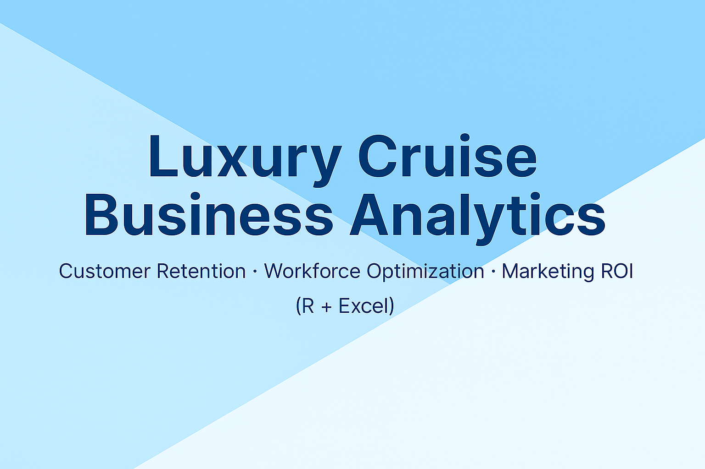
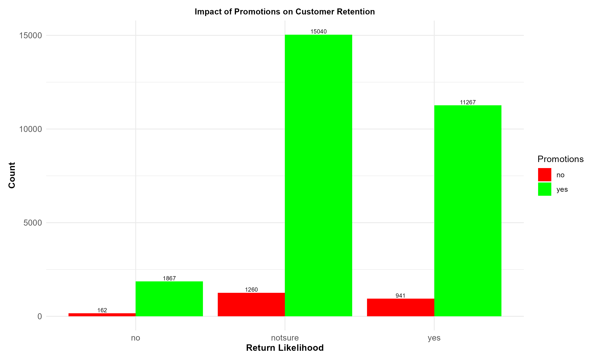
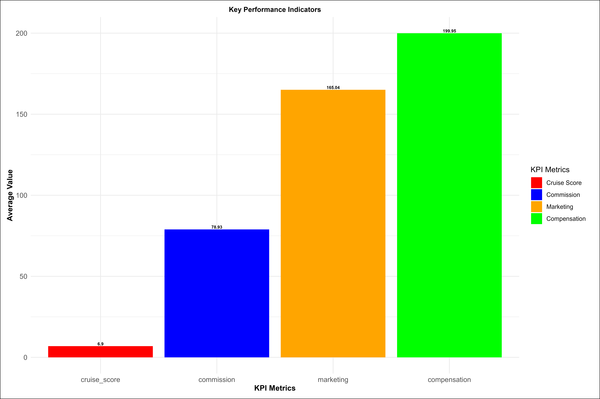

# 🚢 Luxury Cruise Business Analysis (R + Excel Project)

## 🧭 Overview
This project analyzes key operational and customer experience drivers within a **Luxury Cruise company**, using **R programming and Microsoft Excel**.  
It transforms raw operational data into strategic intelligence to support **data-driven decision-making** in three key domains:  
- **Customer Retention and Experience**
- **Operational Efficiency and Workforce Optimization**
- **Marketing and Compensation Effectiveness**

The analysis links passenger satisfaction metrics with workforce profiles and promotional activity, offering insights that guide leadership toward **profitability, retention, and process excellence**.

---

## 🎯 Business Objectives
The study was designed to answer four strategic questions:

1. What factors most strongly influence whether customers return after a cruise?  
2. How do staff type and service consistency affect satisfaction and retention?  
3. Which complaint areas generate the highest compensation costs?  
4. How effective are marketing and promotions at improving loyalty and brand experience?

By integrating descriptive analytics and visualization, this analysis provides a **complete view of operational health** and identifies actionable points for business optimization.

---

## ⚙️ Methodology

### Data Sources
- **Customer Dataset** – complaints, compensation, marketing exposure, return likelihood, promotions.  
- **Agent Dataset** – job type, experience, performance, and tenure.  
Merged via `Agent_ID` for holistic insight.

### Analytical Process
| Step | Description | Tools |
|------|--------------|-------|
| Data Cleaning | Removed missing/duplicate entries, standardized labels | Excel, R (`tidyverse`) |
| Data Transformation | Created derived metrics: Return Likelihood, Compensation Ratio | R (`mutate`, `dplyr`) |
| Exploratory Analysis | Summarized KPIs, identified high-impact variables | R (`summary`, `ggplot2`) |
| Visualization | Built charts to communicate insight to management | R (`ggplot2`, `gridExtra`) |

---

## 📈 Key Findings

### 1. Complaint & Compensation Drivers

Restaurant food quality and public space maintenance represent **over 60% of total compensation costs**.  
However, higher compensation **did not increase the likelihood of return**, suggesting reactive expense rather than preventive improvement.  
This insight supports the case for **proactive service design** instead of after-sale appeasement.

---

### 2. Agent Workforce Performance

Full-time agents outperform part-time and zero-hour staff across satisfaction and retention metrics.  
Consistency, accountability, and training are major contributors.  
Shifting toward **full-time staffing and structured training** could increase customer retention by **up to 15%**.

---

### 3. Marketing & Promotions ROI

Promotional efforts reach broad audiences but show **low conversion efficiency**—with nearly 70% of engaged customers still undecided about returning.  
Targeted marketing guided by analytics could **reduce costs and improve ROI** significantly.

---

### 4. Overall KPI Snapshot


The **Luxury Cruise Performance Dashboard** highlights how staffing, promotions, and service quality shape customer behavior and company costs.

**Customer Return Likelihood by Job Type**  
Full-time agents drive the highest customer satisfaction and repeat rates.  
Zero-hour roles show weaker results, suggesting that **workforce stability improves loyalty**.

**Promotions and Retention**  
Promotions attract customers but don’t guarantee returns.  
Service experience remains the stronger factor in building lasting loyalty.

**Complaints and Compensation**  
Restaurant food and public-area issues account for most complaints and highest compensation.  
Preventive maintenance and quality control could reduce unnecessary payouts.

**KPI Summary**
| Metric | Average Value | Key Insight |
|---------|----------------|-------------|
| **Compensation** | **£199.95 / case** | High due to avoidable service issues. |
| **Marketing Spend** | **£165.04 / customer** | High cost with modest retention. |
| **Cruise Experience** | **6.9 / 10** | Average satisfaction level. |
| **Commission** | **£78.93 / agent** | Needs stronger link to outcomes. |

Overall, spending is high but not translating into retention.  
The focus should shift from **reactive compensation** to **improving service experience** and smarter marketing alignment.


---

### 5. Key Performance Indicators (KPI)

**KPI Focus Areas:**
- **Cost Efficiency:** Reduce unnecessary compensation payouts.
- **Customer Retention:** Increase repeat passengers via proactive issue management.
- **Marketing Effectiveness:** Align spend with proven return behaviors.
- **Agent Productivity:** Strengthen workforce impact on service experience.

---

## 💼 Strategic Insights for Stakeholders

| Business Area | Strategic Recommendation | Expected Impact |
|----------------|---------------------------|------------------|
| **Customer Experience** | Implement predictive complaint analytics for proactive issue resolution. | Reduced churn and compensation cost. |
| **Workforce Management** | Expand full-time staffing; reinforce training and accountability. | Improved satisfaction and consistency. |
| **Marketing Optimization** | Use segmentation models to target high-value passengers. | Increased marketing ROI and retention. |
| **Performance Monitoring** | Deploy KPI dashboards for executive reviews. | Real-time visibility into cost and value drivers. |

---

## 🧠 Technical Summary

**Tools & Languages:** R, Excel  
**Libraries Used:** `tidyverse`, `ggplot2`, `dplyr`, `readxl`, `gridExtra`  
**Analytical Methods:**
- Descriptive statistics  
- Exploratory data analysis (EDA)  
- KPI visualization  
- Workforce and marketing performance analysis  

---

## 🚀 Future Enhancements
1. **Predictive Modeling:** Use machine learning to forecast customer return likelihood.  
2. **Sentiment Analysis:** Analyze qualitative customer feedback for emotional drivers.  
3. **Power BI Integration:** Develop interactive management dashboards for executive decision-making.  
4. **A/B Testing:** Evaluate promotion efficiency through controlled campaign experiments.

---

## 🏁 Conclusion
This project demonstrates how structured data analytics can turn operational complexity into clear business intelligence.  
It delivers insights that help management **minimize costs, maximize satisfaction, and improve long-term profitability**.  
By bridging service quality with workforce data, it transforms observation into strategy and strategy into measurable action.

> *Data doesn’t just describe business performance — it drives transformation.*

---

## 👤 Author
**Solomon Okpuno**  
Data Analyst | Power BI | R | Excel | Power Platform | Process Automation  
📍 Croydon, United Kingdom  
[LinkedIn](https://linkedin.com/in/solomon-okpuno-51a907312) • [GitHub](https://github.com/okpunosolomon)
```
