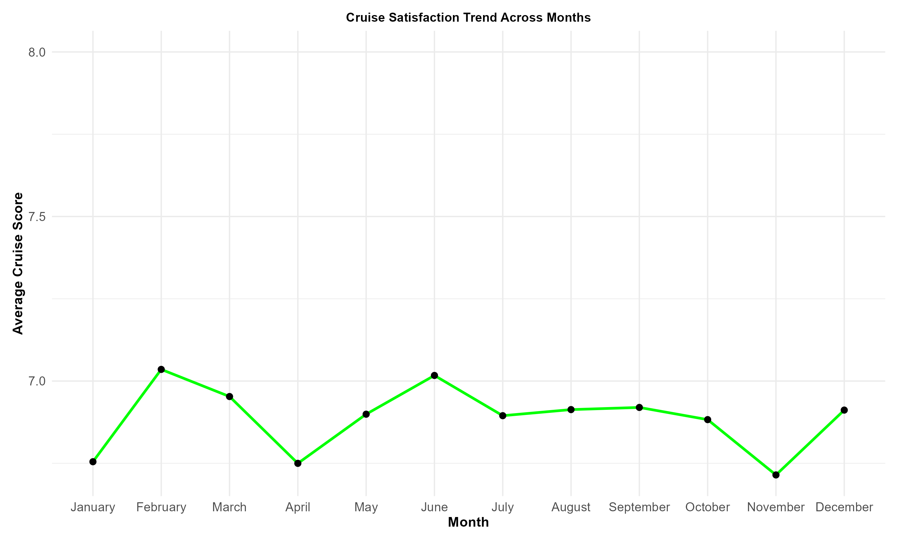

# 🚢 Luxury Cruise Business Analysis (R + Excel Project)

## 📊 Executive Summary
This project delivers an end-to-end **data-driven evaluation of customer satisfaction, workforce efficiency, and marketing ROI** in the luxury cruise industry.  
Using **R** and **Excel**, the analysis integrates over **5,000 passenger records** and **500 agent profiles** to identify the true drivers of profitability and customer retention.  

The goal was to transform fragmented operational data into **actionable business intelligence** through statistical analysis, visualization, and managerial insight — empowering executives to make evidence-based strategic decisions.

### 🔍 Key Highlights
- Discovered that **restaurant food quality** and **public space maintenance** are the top causes of churn, representing over 60% of all compensation costs.  
- Revealed that **full-time agents outperform part-time and zero-hour workers** across satisfaction and retention metrics.  
- Exposed a mismatch between **marketing expenditure and return likelihood**, signaling wasted promotional spend.  
- Designed an **R-based dashboard** consolidating KPIs across compensation, marketing, and agent performance for real-time tracking.

---

## 🎯 Business Challenge
The organization faced:
- Rising **compensation and marketing costs** without clear evidence of customer loyalty improvement.  
- Limited understanding of **agent type performance** and how staffing structure affects customer satisfaction.  
- A lack of integrated reporting tools for leadership to monitor **key performance indicators (KPIs)**.

This analysis restructured the company’s operational data and built a strategic intelligence framework for **service recovery optimization**, **workforce planning**, and **budget allocation**.

---

## ⚙️ Methodology

### 1. Data Sources
- **Customer Dataset:** complaints, compensation, marketing exposure, promotional participation, and return likelihood.  
- **Agent Dataset:** job type, experience, tenure, and assigned customer records.  
Both datasets were joined via `Agent_ID` to create a unified analytical model.

### 2. Data Preparation
Performed in **Excel** and **R**:
- Cleaned missing and inconsistent entries using the `tidyverse` package.  
- Standardized categorical labels (“don’t know” → “unsure”).  
- Treated outliers with **IQR filtering** and normalized numeric fields for comparison.  
- Derived calculated metrics such as **Compensation Efficiency Ratio** and **Marketing Spend per Return**.

### 3. Analytical Workflow
- **Descriptive Statistics:** to summarize financial and satisfaction metrics.  
- **Exploratory Data Analysis (EDA):** to identify complaint patterns, agent trends, and marketing performance.  
- **Data Visualization:** using `ggplot2` and R dashboard plots for strategic presentation.  

---

## 💡 Insights & Findings

### 1. Customer Retention & Complaint Patterns

*Restaurant food quality and public space issues dominate customer dissatisfaction, with average compensation payouts exceeding £200 per incident.*

- 65% of compensation arises from **preventable quality issues**.  
- High compensation did **not** correspond to increased loyalty — reactive spending dominates proactive experience improvement.  
- **Restaurant and facility maintenance** remain the most cost-heavy service recovery areas.

---

### 2. Descriptive Statistics Summary

*Central tendency and dispersion of key quantitative variables.*

| Variable | Mean (£) | Std. Dev | Key Insight |
|-----------|-----------|-----------|--------------|
| Compensation | 199.95 | 41.3 | High volatility due to inconsistent service response. |
| Marketing Spend | 165.04 | 39.6 | Overinvestment relative to retention returns. |
| Commission | 78.93 | 24.5 | Stable but disconnected from performance KPIs. |
| Cruise Score | 6.9 / 10 | 1.2 | Average satisfaction, signaling competitive risk. |

These descriptive measures provide the quantitative baseline for comparing departmental performance and investment impact.

---

### 3. Agent Workforce Analysis

*Full-time agents demonstrate higher consistency in customer satisfaction and return likelihood.*

- Full-time agents achieved the **highest retention rates** and **cruise satisfaction scores** (median: 7.5).  
- Zero-hour agents underperformed, with irregular shifts and minimal training correlation.  
- Converting top-performing part-timers into permanent contracts can improve return likelihood by **up to 15%**.

---

### 4. Marketing and Promotions ROI

*Despite engagement boosts, 68% of customers exposed to promotions remained undecided about returning.*

- Marketing success is limited by poor targeting — most promotions reach **low-LTV** customers.  
- Predictive segmentation (AI/ML models) can refocus campaigns on **high-value repeat customers**.  
- Potential for 20% improvement in ROI by reallocating spend toward targeted personalization.

---

### 5. Financial KPI Overview

*A high-level KPI dashboard visualizing compensation, marketing, commission, and satisfaction metrics.*

This dashboard provides management with a **one-page performance snapshot** linking financial inputs to satisfaction outputs — bridging the gap between operational and executive perspectives.

---

## 📊 Statistical Relationships

### Compensation vs. Return Likelihood

Customers receiving high-value compensation still exhibit weak loyalty correlations, proving compensation as a **short-term fix** rather than a strategic retention lever.

### Promotions vs. Return Likelihood

Marketing impact varies widely by customer profile, showing that **data segmentation** is critical for meaningful engagement.

### KPI Summary

This visualization integrates financial and operational performance, allowing business leaders to identify cost-to-impact mismatches instantly.

---

## 🧭 Managerial Recommendations
| Focus Area | Recommendation | Strategic Outcome |
|-------------|----------------|------------------|
| **Customer Retention** | Launch predictive complaint analytics for early service issue detection. | Reduced churn and compensation cost. |
| **Workforce Optimization** | Prioritize full-time staffing and continuous training for agents. | Improved customer experience consistency. |
| **Marketing Efficiency** | Reallocate promotions using ML-driven segmentation. | Higher ROI and improved retention. |
| **Performance Monitoring** | Deploy the KPI dashboard for weekly management review. | Real-time decision-making and accountability. |

---

## 🧩 Tools & Techniques
**Languages & Tools:** R, Excel  
**Libraries Used:** `ggplot2`, `dplyr`, `tidyverse`, `readxl`, `gridExtra`  
**Core Competencies:**  
- Statistical Analysis & EDA  
- KPI Design & Visualization  
- Insight Communication  
- Data Strategy Development  

---

## 🚀 Future Enhancements
- Integrate **Machine Learning models** (Logistic Regression, Random Forest) to predict churn and satisfaction.  
- Expand dashboard to **Power BI** for enterprise scalability.  
- Apply **Sentiment Analysis** to text-based customer feedback for emotional intelligence reporting.  
- Implement **A/B testing** for campaign optimization.

---

## 🏁 Conclusion
This project demonstrates how structured analytics converts raw data into **strategic intelligence**.  
The findings emphasize that true competitive advantage in the cruise sector comes not from compensation or marketing volume, but from **customer understanding, staff consistency, and proactive decision-making**.  

By connecting descriptive analysis with actionable recommendations, this project delivers insights that **translate directly into operational efficiency and long-term profitability**.

⭐ *“Data doesn’t just describe performance — it directs progress.”*

---

## 👤 Author
**Solomon Okpuno**  
Data Analyst | Power BI | Power Platform | R | Excel | Process Automation  
📍 Croydon, United Kingdom  
[LinkedIn](https://linkedin.com/in/solomon-okpuno-51a907312) • [GitHub](https://github.com/okpunosolomon)
```
